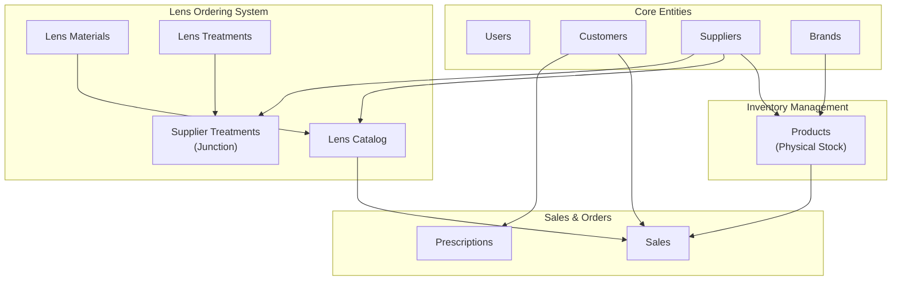
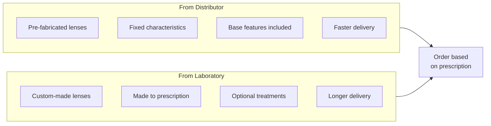

# Optikt Module Architecture

This document describes the architecture and relationships between the core modules of Optikt, an optical store management system.

## Overview

The system is organized into distinct modules that handle different aspects of the optical business:



---

## Module 1: Products

**Status**: 🔄 In Progress  
**Purpose**: Manage physical inventory items that are kept in stock.

### Product Types

| Type           | Description                       | Requires Stock |
| -------------- | --------------------------------- | -------------- |
| `FRAME`        | Eyeglass frames                   | ✅ Yes         |
| `SUNGLASSES`   | Sunglasses                        | ✅ Yes         |
| `CONTACT_LENS` | Contact lenses                    | ✅ Yes         |
| `ACCESSORY`    | Cases, cloths, cleaning solutions | ✅ Yes         |
| `LENS`         | Pre-made/finished lenses in stock | ⚠️ Optional    |

### Key Fields

- `sku` - Unique stock keeping unit (e.g., "MT-23-C1")
- `name` - Product name
- `type` - ProductType enum value
- `brandId` - FK to brands table
- `supplierId` - FK to suppliers table
- `color`, `size` - Physical characteristics
- `purchasePrice`, `salePrice` - Pricing
- `stock`, `minStock` - Inventory levels (triggers low stock alerts)
- `imageUrl` - Product image

### Business Rules

1. Each color/size variant is a separate product with its own SKU
2. Low stock alert triggers when `stock <= minStock`
3. Profit margin = `((salePrice - purchasePrice) / purchasePrice) * 100`
4. Products with type `LENS` may not require stock control (ordered on demand)

---

## Module 2: Lens Materials

**Status**: ⏳ Pending  
**Purpose**: Configurable catalog of lens materials.

### Description

Materials are the base compound of optical lenses. Each material has different properties that affect weight, thickness, and optical clarity.

### Common Materials

| Code     | Name            | Refractive Index | Notes                              |
| -------- | --------------- | ---------------- | ---------------------------------- |
| `CR39`   | CR-39 / Organic | 1.50             | Standard, most common              |
| `POLY`   | Polycarbonate   | 1.59             | Impact resistant, thin             |
| `HI160`  | High Index 1.60 | 1.60             | Thinner for stronger prescriptions |
| `HI167`  | High Index 1.67 | 1.67             | Even thinner                       |
| `HI174`  | High Index 1.74 | 1.74             | Thinnest available                 |
| `TRIVEX` | Trivex          | 1.53             | Lightweight, impact resistant      |

### Key Fields

- `name` - Display name (e.g., "CR-39")
- `code` - Internal code (e.g., "CR39")
- `refractiveIndex` - Optical property (1.50, 1.60, etc.)
- `description` - Additional details
- `isActive` - Whether material is available

### Relationships

- **Used by**: Lens Catalog Items (each item has one material)

---

## Module 3: Lens Treatments

**Status**: ⏳ Pending  
**Purpose**: Configurable catalog of lens treatments/coatings.

### Description

Treatments are coatings or processes applied to lenses to enhance their properties. Prices vary by supplier.

### Common Treatments

| Code         | Name              | Description                   |
| ------------ | ----------------- | ----------------------------- |
| `AR`         | Anti-Reflective   | Reduces glare and reflections |
| `BLUE_BLOCK` | Blue Light Filter | Filters harmful blue light    |
| `PHOTO`      | Photochromic      | Darkens in sunlight           |
| `UV`         | UV Protection     | Blocks ultraviolet rays       |
| `SCRATCH`    | Scratch Resistant | Harder surface coating        |
| `HYDRO`      | Hydrophobic       | Repels water and smudges      |

### Key Fields

- `name` - Display name
- `code` - Internal code
- `description` - What it does
- `isActive` - Whether treatment is available

### Relationships

- **Linked via**: Supplier Lens Treatments (junction table with prices per supplier)

---

## Module 4: Supplier Lens Treatments (Junction)

**Status**: ⏳ Pending  
**Purpose**: Link treatments to suppliers with specific pricing.

### Description

Different suppliers offer different treatments at different prices. This junction table maps which treatments each supplier offers and at what cost.

### Key Fields

- `supplierId` - FK to suppliers
- `treatmentId` - FK to lens_treatments
- `price` - Cost of this treatment from this supplier
- `isAvailable` - Whether currently offered

### Example Data

| Supplier   | Treatment       | Price  |
| ---------- | --------------- | ------ |
| Lab Vision | Anti-Reflective | $15.00 |
| Lab Vision | Blue Block      | $25.00 |
| Opti-Lens  | Anti-Reflective | $18.00 |
| Opti-Lens  | Photochromic    | $45.00 |

---

## Module 5: Lens Catalog

**Status**: ⏳ Pending  
**Purpose**: Catalog of lenses available for ordering from suppliers.

### Description

This is the **core module for prescription lens ordering**. Unlike Products (which are physical stock), Lens Catalog items represent lenses that can be ordered from suppliers based on the customer's prescription.

### Two Types of Lens Sources



### Lens Types

| Type            | Description           | Prescription Fields        |
| --------------- | --------------------- | -------------------------- |
| `SINGLE_VISION` | Single focal point    | Sphere, Cylinder           |
| `BIFOCAL`       | Two focal zones       | Sphere, Cylinder, Addition |
| `PROGRESSIVE`   | Graduated focal zones | Sphere, Cylinder, Addition |
| `READING`       | Near vision only      | Sphere                     |

### Key Fields

- `supplierId` - FK to supplier (laboratory or distributor)
- `name`, `brand` - Lens identification
- `type` - LensType enum (single vision, bifocal, progressive)
- `materialId` - FK to lens_materials
- **Prescription Ranges**:
  - `sphereMin`, `sphereMax` - Available sphere power range
  - `cylinderMin`, `cylinderMax` - Available cylinder power range
  - `additionMin`, `additionMax` - Available addition range (for bifocal/progressive)
- `baseFeatures` - JSON with included features (for distributors)
- `isPhotochromic` - Whether lens is photochromic
- `basePrice` - Starting price before treatments
- `deliveryDays` - Expected delivery time
- `stock` - Optional (some distributors keep stock)

### Prescription Search Feature

The key feature of this module is **searching by prescription**:

```
User input:
  Sphere: -2.50
  Cylinder: -1.00
  Addition: +2.00 (if progressive)

System finds all catalog items where:
  sphereMin <= -2.50 <= sphereMax
  AND cylinderMin <= -1.00 <= cylinderMax
  AND additionMin <= +2.00 <= additionMax (if applicable)
```

Results show all matching lenses from all suppliers (laboratories and distributors), allowing the user to compare prices, materials, and delivery times.

### Calculating Final Price

```
Final Price = Base Price + Sum(Selected Treatment Prices)
```

Where treatment prices come from the `supplier_lens_treatments` table for that specific supplier.

---

## Module 6: Sales

**Status**: ⏳ Pending  
**Purpose**: Record and manage customer sales.

### Description

A sale can include:

- Products from inventory (frames, accessories, etc.)
- Lenses ordered from the catalog
- Associated prescriptions

### Key Entities

#### Sale

- `customerId` - FK to customers
- `userId` - FK to users (salesperson)
- `saleDate` - When the sale was made
- `subtotal`, `discount`, `tax`, `total` - Pricing
- `status` - PENDING, COMPLETED, CANCELLED
- `notes` - Additional information

#### Sale Item

- `saleId` - FK to sale
- `productId` - FK to products (if inventory item)
- `lensCatalogItemId` - FK to lens_catalog_items (if ordered lens)
- `quantity`, `unitPrice`, `subtotal`
- Lens details: `sphere`, `cylinder`, `axis`, `addition`, `pd`

#### Prescription

- `customerId` - FK to customers
- `prescriptionDate` - When prescribed
- Right eye: `odSphere`, `odCylinder`, `odAxis`, `odAddition`
- Left eye: `osSphere`, `osCylinder`, `osAxis`, `osAddition`
- `pd` - Pupillary distance
- `doctorName` - Optometrist name
- `notes` - Additional notes

---

## Implementation Order

| Order | Module                   | Dependencies                 | Complexity |
| ----- | ------------------------ | ---------------------------- | ---------- |
| 1     | Products                 | Brands, Suppliers            | Medium     |
| 2     | Lens Materials           | None                         | Low        |
| 3     | Lens Treatments          | None                         | Low        |
| 4     | Supplier Lens Treatments | Suppliers, Treatments        | Low        |
| 5     | Lens Catalog             | Suppliers, Materials         | High       |
| 6     | Sales                    | Products, Catalog, Customers | High       |

---

## Database Schema Summary

Tables already defined in the schema:

- ✅ `products` - Physical inventory
- ✅ `lens_materials` - Material catalog
- ✅ `lens_treatments` - Treatment catalog
- ✅ `lens_catalog_items` - Lens catalog
- ✅ `supplier_lens_treatments` - Treatment pricing
- ✅ `sales` - Sales records
- ✅ `sale_items` - Sale line items
- ✅ `prescriptions` - Customer prescriptions

All schemas are ready; only the UI and remote functions need to be implemented.
